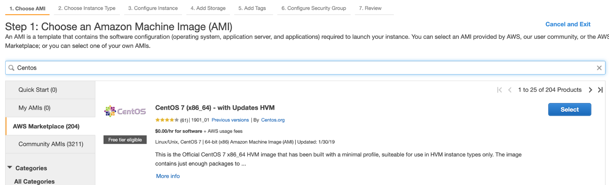
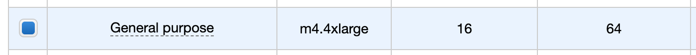
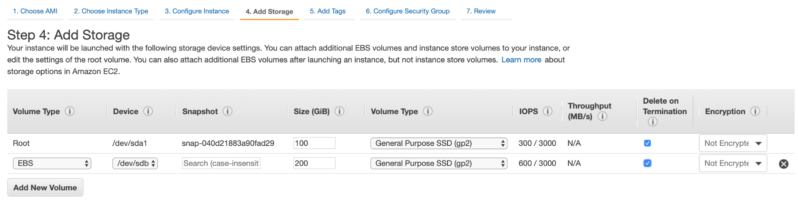
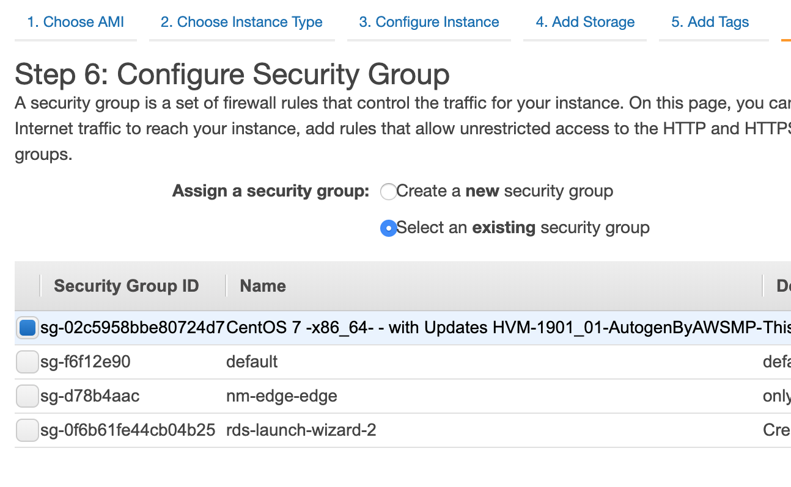

# One Node Edge2AI CDH Cluster

This script automatically sets up a CDH cluster in the public cloud (AWS or Azure) on a single VM with the following 16 services:

- CDSW
- MiNiFi
- EFM
- NiFi
- NiFi CA
- NiFi Registry
- Kafka
- Kudu
- Impala
- Hue
- Hive
- Spark
- Oozie
- HDFS
- YARN
- ZK

More services can be added or removed by updating the template used.

As this cluster is meant to be used for demos, experimenting, training, and workshops, it doesn't setup Kerberos and TLS.

## Instructions

Below are instructions for creating the cluster with or without CDSW service. CDSW requires some extra resources (more powerful instance, and a secondary disk for the docker device).

### Provisioning Cluster without CDSW

- Create a Centos 7 VM with at least 8 vCPUs/ 32 GB RAM. Choose the plain vanilla Centos image, not a cloudera-centos image.
- OS disk size: at least 50 GB.

### Provisioning Cluster with CDSW

- Create a Centos 7 VM with at least 16 vCPUs/ 64 GB RAM. Choose the plain vanilla Centos image, not a cloudera-centos image.
- OS disk size: at least 100 GB.
- Docker device disk: at least 200GB SSD disk.
  - Node: you need a fast disk more than you need a large disk: aim for a disk with 3000 IOPS. This might mean choosing a 1TB disk.

### Configuration and installation

- If you created the VM on Azure and need to resize the OS disk, here are the [instructions](scripts/how-to-resize-os-disk.md).
- add 2 inbound rules to the Security Group:
  - to allow your IP only, for all ports.
  - to allow the VM's own IP, for all ports.
- ssh into VM and copy this repo.

```
sudo su -
yum install -y git
git clone https://github.com/phdata/edge2ai-sandbox
cd edge2ai-sandbox
```

The script `setup.sh` takes 3 arguments:
- the cloud provider name: `aws`,`azure`,`gcp`.
- the template file.
- OPTIONAL the Docker Device disk mount point.

Example: create cluster without CDSW on AWS using default_template.json
```
./setup.sh aws templates/default_template.json
```

Example: create cluster with CDSW on Azure using cdsw_template.json
```
./setup.sh azure templates/cdsw_template.json /dev/sdc
```

Wait until the script finishes, check for any error.

### Example Buildout

#### Create AWS EC2 Instance

**Step 1**: Select a CentOS AMI



**Step 2**: Select EC2 Node Size - This is sized for a CDSW deployment



**Step 3**: Accept the default this page and "Continue"

**Step 4**: Define storage mounts for EC2 Instance and CDSW



**Step 5**: Accept the default of tags and "Continue"

**Step 6**: Define or Select a Network Security Group to provide Network access to your machine



**Step 7**: Select Private Key and Deploy Instance

#### Log into EC2 Instance and Build Cluster

**Step 1**: SSH into remote node

- Find the Public IP address generated by AWS
- SSH to the IP provided
  - If this fails to connect, check that the Network Security group is properly defined

```
ssh -i ~/.ssh/<aws_key.pem> centos@<aws_public_ip>
```

**Step 2**: Clone Remote Repository

```
sudo su -
yum install -y git
git clone https://github.com/phdata/edge2ai-sandbox
cd edge2ai-sandbox
```

**Step 3**: Create CDH Cluster

This example is demonstrating how to build a CDSW enabled instance with CDH. Based on the build thus far the following buildout could be used.

```
./setup.sh aws templates/cdsw_template.json /dev/xvdb
```

**Note**: This will run for 10-20 minutes and once complete the cluster should be accessible.

#### Connect to Cluster Services

At this point you should be able to connect to the following endpoints and be able to run through the workshop from this build.

- **Cloudera Manager**: <aws_public_ip>:7180
- **Edge Flow Manager**: <aws_public_ip>:10080/efm/ui
- **Apache NiFi**: <aws_public_ip>:8080/nifi
- **Apache NiFi Registry**: <aws_public_ip>:18080/nifi-registry
- **HUE**: <aws_public_ip>:8888
- **CDSW**: cdsw.<aws_public_ip>.nip.io


## Use

Once the script returns, you can open Cloudera Manager at [http://<public-IP\>:7180](http://<public-IP>:7180)

Wait for about 20-30 mins for CDSW to be ready. You can monitor the status of CDSW by issuing the `cdsw status` command.

You can use `kubectl get pods -n kube-system` to check if all the pods that the role `Master` is suppose to start have really started.

You can also check the CDSW deployment status on CM > CDSW service > Instances > Master role > Processes > stdout.

## Troubleshooting and known issues

**Clock Offset**: the NTPD service which is required by Kudu and the Host is not installed. For the moment, just put
`--use-hybrid-clock=false`  in Kudu's Configuration property `Kudu Service Advanced Configuration Snippet (Safety Valve) for gflagfile` and suppressed all other warnings.

### Docker device

To find out what the docker device mount point is, use `lsblk`. See below examples:


AWS, using a M5.2xlarge or M5.4xlarge
```
$ lsblk
NAME        MAJ:MIN RM  SIZE RO TYPE MOUNTPOINT
nvme0n1     259:1    0  100G  0 disk
+-nvme0n1p1 259:2    0  100G  0 part /
nvme1n1     259:0    0 1000G  0 disk

$ ./setup.sh aws templates/cdsw_template.json /dev/nvme1n1
```

Azure Standard D8s v3 or Standard D16s v3
```
$ lsblk
NAME   MAJ:MIN RM  SIZE RO TYPE MOUNTPOINT
fd0      2:0    1    4K  0 disk
sda      8:0    0   30G  0 disk
+-sda1   8:1    0  500M  0 part /boot
+-sda2   8:2    0 29.5G  0 part /
sdb      8:16   0   56G  0 disk
+-sdb1   8:17   0   56G  0 part /mnt/resource
sdc      8:32   0 1000G  0 disk
sr0     11:0    1  628K  0 rom

$ ./setup.sh azure templates/cdsw_template.json /dev/sdc
```

GCP n1-standard-8 or n1-standard-16
```
$ lsblk
NAME   MAJ:MIN RM  SIZE RO TYPE MOUNTPOINT
sda      8:0    0  100G  0 disk
└─sda1   8:1    0  100G  0 part /
sdb      8:16   0 1000G  0 disk

$ ./setup.sh gcp templates/cdsw_template.json /dev/sdb
```
